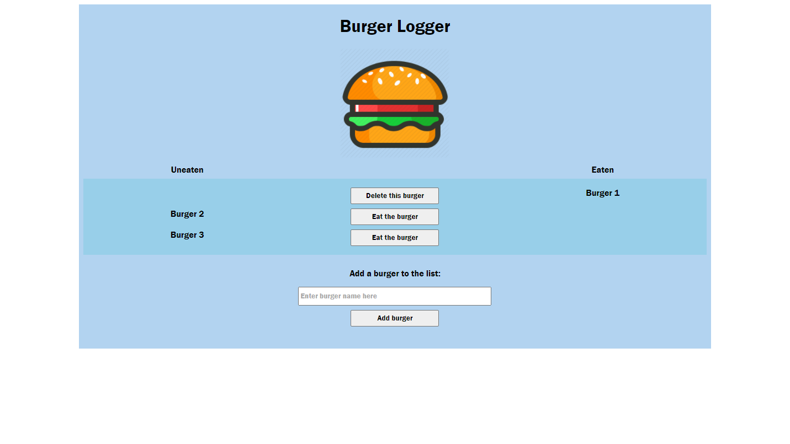

# Node Express Handlebars

## Description
This is the source code for a burger logger that can take in new entries, move them from one column to another, and delete them. This app is mostly a basic introduction to the MVC structure, using JawDB as the backend database to save data on.

This app is deployed on heroku at [https://jcx-burger.herokuapp.com/](https://jcx-burger.herokuapp.com/)

## Table of Contents
* [Installation](#installation)
* [Usage](#usage)
* [License](#license)

## Installation
This app can be installed locally by downloading the repo, and requires an existing local MySQL database server. After downloading the repo, run 'npm install' to install the required packages. Navigate to the /config/orm.js and update the database and password in line 1.

## Usage
Run 'node server' to start the server, then navigate to http://localhost:8080 in any browser to view the app.

## License
ISC License: Copyright (C) 2021 JingChang Xiao 

Permission to use, copy, modify, and/or distribute this software for any purpose with or without fee is hereby granted, provided that the above copyright notice and this permission notice appear in all copies. 

THE SOFTWARE IS PROVIDED "AS IS" AND THE AUTHOR DISCLAIMS ALL WARRANTIES WITH REGARD TO THIS SOFTWARE INCLUDING ALL IMPLIED WARRANTIES OF MERCHANTABILITY AND FITNESS. IN NO EVENT SHALL THE AUTHOR BE LIABLE FOR ANY SPECIAL, DIRECT, INDIRECT, OR CONSEQUENTIAL DAMAGES OR ANY DAMAGES WHATSOEVER RESULTING FROM LOSS OF USE, DATA OR PROFITS, WHETHER IN AN ACTION OF CONTRACT, NEGLIGENCE OR OTHER TORTIOUS ACTION, ARISING OUT OF OR IN CONNECTION WITH THE USE OR PERFORMANCE OF THIS SOFTWARE.
